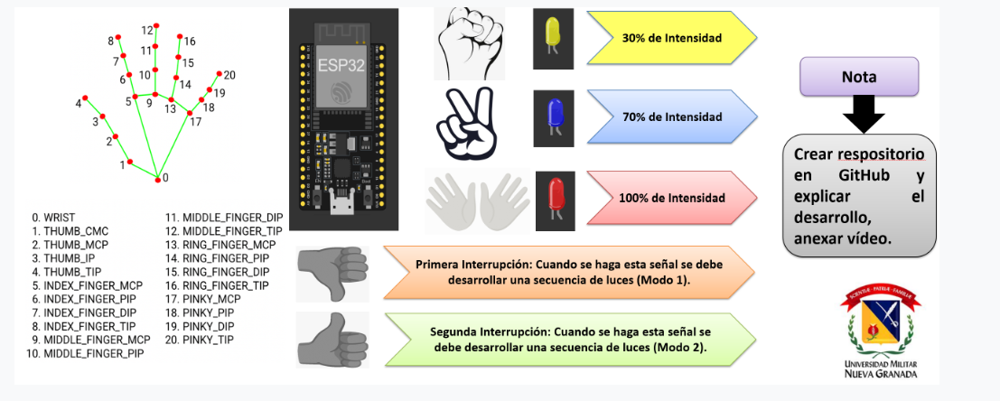
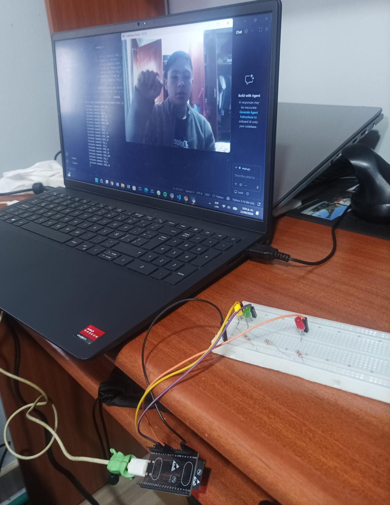

# Actividad 4 – Control de iluminación por gestos de la mano (MediaPipe + ESP32)

**Asignatura:** Micros – Universidad Militar Nueva Granada

Sistema que reconoce gestos de la mano con la cámara del computador usando **MediaPipe Gesture Recognizer** y controla LEDs conectados a una **ESP32** a través del puerto serial.



## Video de demostración

[`video/VideoActividad4Micros.mp4`](video/VideoActividad4Micros.mp4)

## Montaje



| LED      | Pin ESP32 | Tipo de salida |
|----------|-----------|----------------|
| Amarillo | GPIO 16   | PWM (`ledcAttach`, 5 kHz, 8 bits) |
| Azul     | GPIO 17   | Digital |
| Rojo     | GPIO 18   | Digital |

Cada LED va en serie con una resistencia a GND.

## Gestos y comportamiento

| Gesto (MediaPipe)        | Comando serial | Acción en la ESP32 |
|--------------------------|----------------|--------------------|
| `Closed_Fist` (puño)     | `MODE_30`      | LED amarillo al 30 % (PWM = 76/255) |
| `Victory` (paz)          | `MODE_70`      | LED azul encendido |
| 2 × `Open_Palm` (dos manos abiertas) | `MODE_100` | LED rojo encendido |
| `Thumb_Down`             | `SEQ_1`        | Secuencia 1: parpadeo alternado azul / rojo |
| `Thumb_Up`               | `SEQ_2`        | Secuencia 2: barrido amarillo → azul → rojo |

## Desarrollo

El sistema tiene dos partes que se comunican por serial a 115200 baudios:

**1. Reconocimiento (PC – `python/main.py`)**
- Captura video con OpenCV y lo voltea horizontalmente (efecto espejo).
- Cada fotograma se convierte a RGB y se pasa a `GestureRecognizer` de MediaPipe Tasks con el modelo `gesture_recognizer.task` (hasta 2 manos).
- Con la lista de gestos detectados: si hay dos manos y ambas son `Open_Palm` se envía `MODE_100`; en otro caso se usa el gesto de la primera mano para elegir el comando.
- `enviar_comando()` solo escribe por serial cuando el comando cambia, para no saturar el puerto ni repetir secuencias.
- Se sale con la tecla `q`.

**2. Actuación (ESP32 – `firmware/Actividad_4_Micros/Actividad_4_Micros.ino`)**
- Lee líneas de texto por serial, las limpia con `trim()` y compara con los comandos.
- Antes de cada modo apaga todos los LEDs (`apagarTodo()`), de modo que solo haya un estado activo.
- El LED amarillo usa PWM; los otros dos se manejan como salida digital.
- Las secuencias de luces se ejecutan con ciclos `for` y `delay()`.

## Cómo ejecutarlo

### 1. Cargar el firmware
1. Abrir `firmware/Actividad_4_Micros/Actividad_4_Micros.ino` en Arduino IDE.
2. Tener instalado el core **ESP32 para Arduino v3.x** (usa `ledcAttach`).
3. Seleccionar la placa ESP32 y el puerto, y subir el programa.

### 2. Ejecutar el programa de Python
```bash
cd python
pip install -r requirements.txt
```
Editar `PUERTO_SERIAL` en `main.py` con el puerto de la ESP32 (por ejemplo `COM5`) y ejecutar:
```bash
python main.py
```
Cerrar el Monitor Serie del Arduino IDE antes de ejecutarlo, porque ocupa el puerto.

## Estructura del repositorio

```
.
├── README.md
├── docs/
│   ├── enunciado.png
│   └── montaje.jpg
├── firmware/Actividad_4_Micros/Actividad_4_Micros.ino
├── python/
│   ├── main.py
│   ├── gesture_recognizer.task
│   └── requirements.txt
└── video/VideoActividad4Micros.mp4
```

## Referencias
- [MediaPipe Gesture Recognizer – demo web](https://google-ai-edge.github.io/mediapipe-samples-web/#/vision/gesture_recognizer)
- [Documentación de MediaPipe Gesture Recognizer](https://ai.google.dev/edge/mediapipe/solutions/vision/gesture_recognizer)
